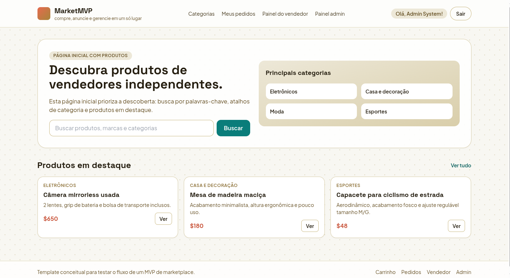

#  **MarketMVP**


> Este projeto foi desenvolvido como Atividade avaliada da disciplina Web-2, do Instituto Federal do Rio Grande do Sul.


---

## 📄 **Requisitos**

- [x] **Criacao de conta:**
    Formulário com nome, e-mail, senha e tipo de usuário, com validação de e-mail único e senha armazenada de forma segura via hash.
- [x] **Login:**
    Autenticação por e-mail e senha com gerenciamento de sessão (cookie) e proteção de rotas para usuários autenticados.
- [x] **Tipos de usuario:**
    Três perfis distintos (Admin, Comprador, Vendedor) com restrições de acesso específicas conforme a funcionalidade.
- [x] **Gestao de usuarios (apenas admin):**
    Área administrativa para listar usuários, visualizar tipos, desativar perfis e impedir login de usuários inativos.
- [x] **Validacao de e-mail por senha unica:**
    Envio de código único por e-mail no cadastro, com validação obrigatória antes da ativação da conta, com expiração e opção de reenvio.
- [x] **Auditoria de logs de acoes:**
    Registro em tabela de logs para toda operação (POST, PUT, PATCH, DELETE), contendo data/hora, usuário, método, rota e resumo, com acesso restrito ao admin.


---

## 💻 **Tecnologias utilizadas**

Este projeto foi desenvolvido utilizando as seguintes tecnologias:

- ###  Node.js

- ###  Express
- ###  Better-SQLite3

- ###  Zod

- ###  TypeScript


- ###  BcryptJS


- ###  Nodemailer

- ###  EJS


## 🛠️ Instalação e Configuração

1. Clone este repositório

```bash
git clone https://github.com/AdrianaRaubach/MarketMVP.git
```

2. Instale os pacotes e dependências usando npm

```bash
npm install
```

3. Configure as variáveis de ambiente no arquivo .env

```
SESSION_SECRET=
PORT=
ADMIN_EMAIL=admin@marketmvp.com
ADMIN_PASSWORD=Admin@123456
ADMIN_FIRST_NAME=Admin
ADMIN_LAST_NAME=System
SMTP_USER=
SMTP_PASS=

```

4. Inicie o servidor em modo desenvolvimento

```bash
npx npm run dev
```

5. Acesse a aplicação

```bash
http://localhost:3000
```


## ✏️ Autora

- [Adriana Raubach](https://github.com/AdrianaRaubach)
